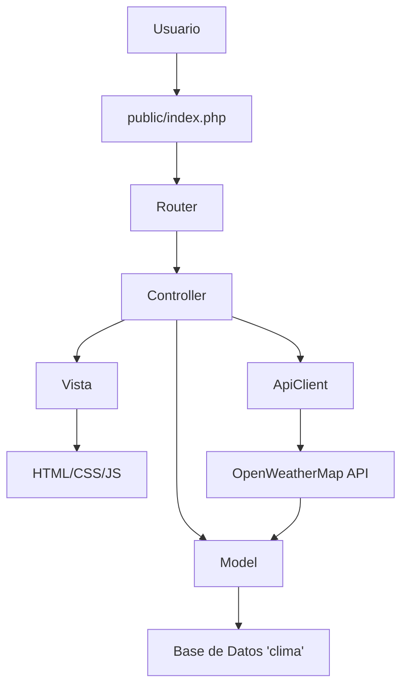
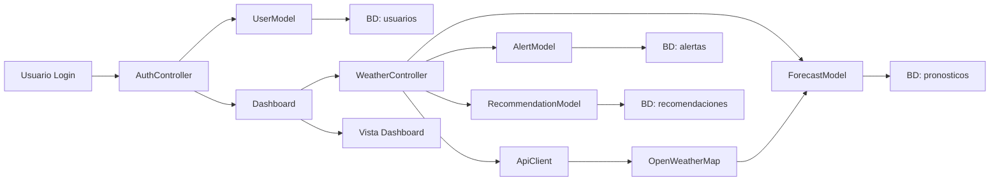

# Arquitectura de la Aplicación Web de Pronósticos Meteorológicos

## Descripción General
La aplicación es una plataforma web en PHP para pronósticos meteorológicos, integrada con la API de OpenWeatherMap. Utiliza el patrón MVC (Modelo-Vista-Controlador) para separar la lógica de negocio, la presentación y el control de flujo. Incluye autenticación de usuarios con roles, dashboard interactivo, alertas automáticas y recomendaciones agrícolas basadas en datos climáticos. La base de datos 'clima' en XAMPP almacena usuarios, pronósticos, alertas y recomendaciones.

## Estructura de Carpetas
La estructura sigue el patrón MVC con separación clara de responsabilidades:

```
Pronostico_meteo/
├── app/                          # Lógica de aplicación
│   ├── controllers/              # Controladores (UserController, WeatherController, etc.)
│   ├── models/                   # Modelos (User, Forecast, Alert, Recommendation)
│   ├── views/                    # Vistas (HTML/PHP templates)
│   │   ├── layouts/              # Layouts base (header, footer)
│   │   ├── dashboard/            # Vistas del dashboard
│   │   ├── auth/                 # Vistas de autenticación
│   │   └── weather/              # Vistas de pronósticos
│   └── core/                     # Núcleo de la aplicación
│       ├── Database.php          # Conexión a BD
│       ├── Router.php            # Enrutamiento
│       ├── Session.php           # Gestión de sesiones
│       └── ApiClient.php         # Cliente para APIs externas
├── public/                       # Archivos públicos
│   ├── index.php                 # Punto de entrada
│   ├── css/                      # Estilos CSS
│   ├── js/                       # JavaScript
│   └── assets/                   # Imágenes, iconos
├── config/                       # Configuraciones
│   ├── database.php              # Config BD
│   └── api.php                   # Config API OpenWeatherMap
├── vendor/                       # Dependencias (Composer)
└── logs/                         # Archivos de log
```

## Patrón MVC
- **Modelo (Model)**: Maneja la lógica de datos y la interacción con la base de datos. Ejemplos: UserModel para autenticación, ForecastModel para pronósticos.
- **Vista (View)**: Presenta los datos al usuario. Usa templates PHP para renderizar HTML dinámico.
- **Controlador (Controller)**: Gestiona las solicitudes del usuario, coordina modelos y vistas. Ejemplos: AuthController para login/registro, DashboardController para el panel principal.

Flujo típico:
1. Usuario accede a una URL (ej. /dashboard).
2. Router dirige a DashboardController.
3. Controller llama a modelos para obtener datos.
4. Datos se pasan a la vista para renderizar.

## Esquema de Base de Datos
Base de datos: `clima` en MySQL (XAMPP).

### Tabla: usuarios
```sql
CREATE TABLE usuarios (
    id INT PRIMARY KEY AUTO_INCREMENT,
    username VARCHAR(50) UNIQUE NOT NULL,
    email VARCHAR(100) UNIQUE NOT NULL,
    password VARCHAR(255) NOT NULL,  -- Hash bcrypt
    role ENUM('admin', 'user') DEFAULT 'user',
    created_at TIMESTAMP DEFAULT CURRENT_TIMESTAMP,
    updated_at TIMESTAMP DEFAULT CURRENT_TIMESTAMP ON UPDATE CURRENT_TIMESTAMP
);
```

### Tabla: pronosticos
```sql
CREATE TABLE pronosticos (
    id INT PRIMARY KEY AUTO_INCREMENT,
    location VARCHAR(100) NOT NULL,
    fecha DATE NOT NULL,
    temperatura_max DECIMAL(5,2),
    temperatura_min DECIMAL(5,2),
    humedad DECIMAL(5,2),
    probabilidad_lluvia DECIMAL(5,2),
    descripcion VARCHAR(255),
    created_at TIMESTAMP DEFAULT CURRENT_TIMESTAMP,
    INDEX idx_location_fecha (location, fecha)
);
```

### Tabla: alertas
```sql
CREATE TABLE alertas (
    id INT PRIMARY KEY AUTO_INCREMENT,
    tipo ENUM('helada', 'sequia', 'granizo') NOT NULL,
    mensaje TEXT NOT NULL,
    location VARCHAR(100),
    fecha_inicio DATE,
    fecha_fin DATE,
    activa BOOLEAN DEFAULT TRUE,
    created_at TIMESTAMP DEFAULT CURRENT_TIMESTAMP,
    INDEX idx_tipo_activa (tipo, activa)
);
```

### Tabla: recomendaciones
```sql
CREATE TABLE recomendaciones (
    id INT PRIMARY KEY AUTO_INCREMENT,
    tipo ENUM('riego', 'siembra', 'cosecha') NOT NULL,
    descripcion TEXT NOT NULL,
    condiciones_climaticas TEXT,
    fecha DATE NOT NULL,
    created_at TIMESTAMP DEFAULT CURRENT_TIMESTAMP,
    INDEX idx_tipo_fecha (tipo, fecha)
);
```

Relaciones: Los pronósticos y alertas pueden asociarse implícitamente por location y fecha. Recomendaciones se generan basadas en pronósticos/alertas.

## Plan de Integración con API de OpenWeatherMap
- **Cliente API**: Clase ApiClient en app/core/ApiClient.php usa cURL para llamadas HTTP.
- **Endpoint principal**: `https://api.openweathermap.org/data/2.5/onecall` para pronóstico extendido (7 días).
- **Parámetros**: API key, coordenadas (lat/lon), unidades métricas, excluir campos innecesarios.
- **Cache**: Almacenar respuestas en BD (tabla pronosticos) para evitar llamadas excesivas (límite API).
- **Actualización**: Job diario/cron para refrescar datos.
- **Mapeo de datos**: Convertir respuesta JSON a objetos PHP y persistir en BD.
- **Alertas automáticas**: Lógica en modelos para detectar condiciones (ej. temp < 0°C para helada) y crear alertas.

## Flujo de Datos entre Componentes
1. **Autenticación**: Usuario envía credenciales → AuthController valida → Session inicia → Redirige a dashboard.
2. **Dashboard**: DashboardController carga datos de modelos (pronósticos, alertas) → Vista renderiza con datos.
3. **API Integration**: WeatherController llama ApiClient → Procesa respuesta → ForecastModel guarda en BD → Actualiza vistas.
4. **Alertas**: AlertModel verifica condiciones en pronósticos → Crea alertas si triggers → Notifica vía email/JS (futuro).
5. **Recomendaciones**: RecommendationModel analiza pronósticos/alertas → Genera sugerencias → Muestra en dashboard.

### Diagrama de Arquitectura (Mermaid)


### Diagrama de Flujo de Datos


Este diseño asegura escalabilidad, separación de responsabilidades y facilidad de mantenimiento.